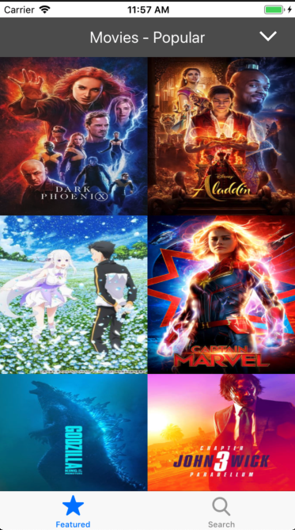
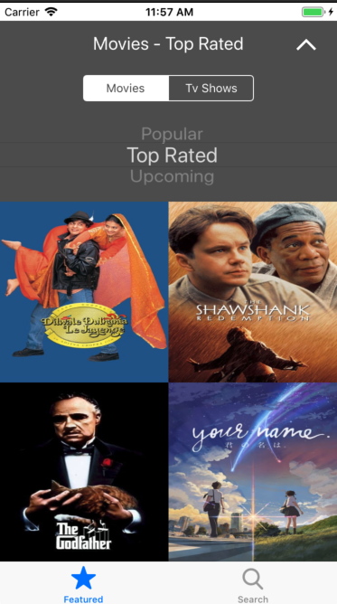
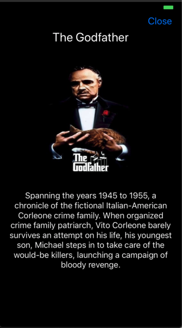
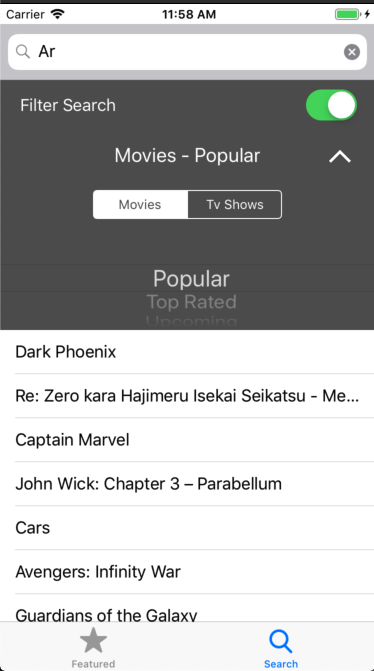

## Estructura de clases

### Modelos
Clases con la información obtenida del API:
* `Item` (base class)
* `Movie`
* `TvShow`
* `Page` (base class)
* `MoviesPage`
* `TvShows` 
* `ItemType` (enum)
* CategoryType` (enum)

### Controllers
* `HomeViewController` : ViewController principal
* `SearchViewController` : ViewController con el buscador offline
* `DetailViewController` : ViewController con el detalle de la pelicula seleccionada

### Views
* `SelectionsSelectorView`: Selector de secciones (serie/pelicula, popular/upcoming/top_rated/etc...)
* `ItemCollectionViewCell: Celda para mostrar la imagen de las peliculas en la pantalla principal

### Networking
* `URLBuilder`: Clase que crea los links URL para la comunicacion con el API.
* `DataTaskFactory`: Crea y configura las URLSessionDataTask` necesarias devolviendo devolviendo objetos ya decodificados.
* `DataProvider`: Clase que se encarga de proporcionar los datos requeridos desde el API. Es la encargada de revisar si es necesario hacer un URL request o los datos ya se encuentran en el 'cache' del dispositivo. También actualiza los datos del `cache` una vez obtenida informacion actualizada desde el API. 

### Storage
* `JSONStore`: Clase que guarda y carga archivos 'json' en/desde el sistema de archivos del dispostivo. 
* `StorageManager`: Clase encargada de organizar la carga y escritura de distintos tipos de objetos en el sistema de archivos del dispositivo. 
* `StorageType` (enum): Para la organización de directorios dentro del sistema de archivos del dispositivo
* `ImageCacheHandler`: Clase para la escritura y lectura de imagenes en el 'NSCache'

### Utilities
* `ItemsFilter`: Para filtrar 'Items' de acuerdo a un 'String'. Utilizado en la pantalla de busqueda offline.
* `UIAlertController+Helpers`: Extension de `UIAllertController` para crear un AlertController ya configurado para mostrar un mensaje de error.
* `UIViewController+Helpers`: Extension de `UIViewController` para setear el ocultamiento del teclado cuando se tapea alguna parte de la pantalla.

### Unit Tests
* `MoviesPageTests`
* `TvShowsPageTest`
* `JSONStoreTest`
* `ItemsFilterTest`

## En qué consiste el principio de responsabilidad única? Cuál es su propósito?
El principio de responsabilidad única es uno de los principios SOLID. Sostiene que cada modulo clase o función debería tener responsabilidad sobre una única funcionalidad del software que integra y a su vez esta reponsabilidad debe estar totalmente encapsulada en esta clase, módulo. 
Este principio permite desarrollar código (principalmente OOP) más ordenado, mejor estructurado lo que hace que sea más fácil de mantener, escalar y testear.

## Qué características tiene, según su opinión, un “buen” código o código limpio
Un "buen" código debe estar bien estructurado, organizado. Debe ser fácil de entender para un nuevo desarrollador que se aproxima al mismo. Debe seguir guidelines comúnmente usadas en el desarrollo del tipo de tecnología al que pertence (iOS, .NET, etc.). Debe tratar de seguir los principios SOLID si está orientado a objetos. Debe ser facil de mantener y extender, para que en caso de solucionar futuros bugs o agregar nuevas funcionalidades no se necesite refactorizar o modificar mucho código existente. De ser posible es bueno que sea TDD.

 
 

